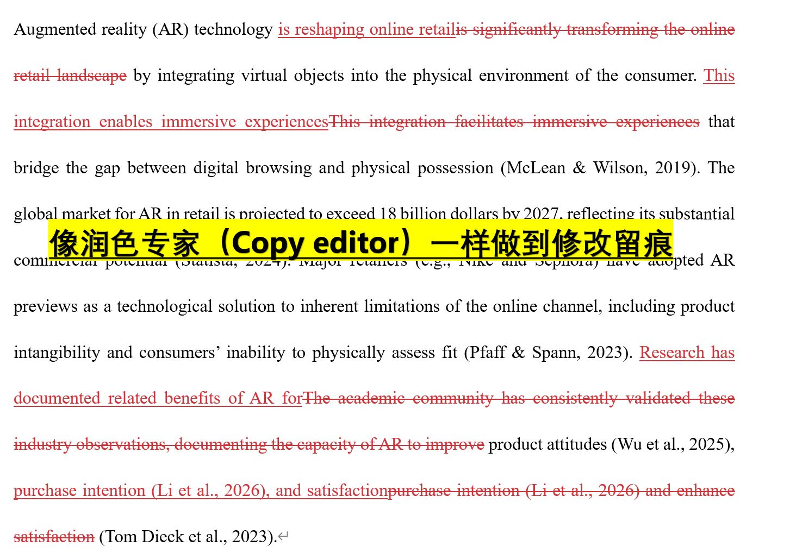
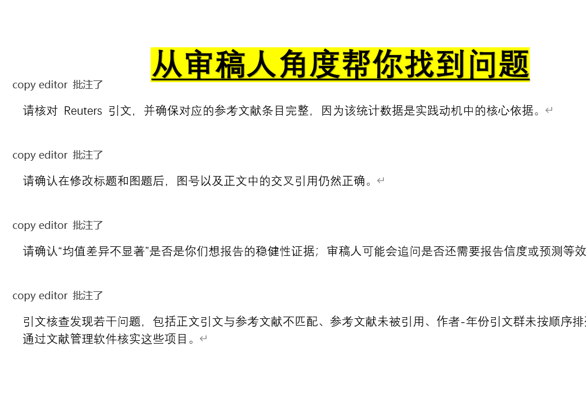
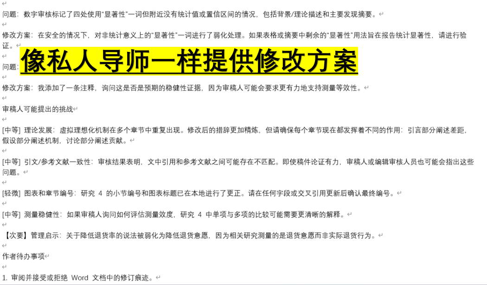

# Copyeditor Skill

English | [中文说明](README.md)

`copyeditor-skill` is a Codex skill for professional academic manuscript copyediting in Microsoft Word `.docx` files. It helps with tracked changes, concise editor comments, formatting preservation, citation/reference checks, number and statistics audits, reviewer-risk notes, delivery packaging, and final DOCX validation.

This repository is a **single installable skill folder**. Copy or clone the whole repository, not only `SKILL.md`, because the skill depends on `references/` and `scripts/`.

## Why This Exists

Many non-native English-speaking researchers face practical friction before submission:

1. The hardest part is often not basic grammar, but finding hidden problems in long sentences, terminology drift, overclaiming, citation order, numbers, tables, captions, and formatting.
2. Academic copyediting must preserve meaning, research-design boundaries, statistical interpretation, citation fields, figure/table references, and Word formatting.
3. Professional copy editors can be expensive or hard to schedule, especially when authors need multiple revision rounds.

`copyeditor-skill` does not replace author judgment or guarantee publication. It turns academic copyediting into a repeatable Codex workflow: preserve the source, edit locally in Word tracked changes, flag author decisions in comments, append a copy editing report, and validate the final file before delivery.

## Who It Is For

- Non-native English-speaking authors preparing journal submissions or revisions.
- Researchers who need language, formatting, citation, number, and reviewer-risk checks for `.docx` manuscripts.
- Editors, research assistants, and supervisors who need reviewable Word tracked-change deliverables.
- Users who want AI-assisted copyediting to be auditable instead of a one-off chat rewrite.

## Skill Index

| Skill | Status | Purpose | Trigger keywords |
|---|---|---|---|
| `copyeditor-skill` | Beta | Academic `.docx` copyediting with Word tracked changes, comments, citation/number audits, formatting preservation, and delivery validation | "copy editing", "proofread", "line edit", "academic editing", "tracked changes", "editor comments", "journal submission editing" |

## Example Output

The screenshots below show real output from `copyeditor-skill` on academic `.docx` manuscripts. The skill is designed to do more than generic polishing: it leaves reviewable Word changes, flags problems from a reviewer-facing perspective, and gives authors concrete revision actions.

### 1. Word tracked changes like a copy editor



### 2. Reviewer-facing comments on citations, figure numbering, and statistics



### 3. Actionable revision plans like a private writing mentor



If this skill saves you time before submission, please consider starring the repository so it is easier to maintain and improve.

## Capabilities

| Capability | Description |
|---|---|
| Word tracked changes | Prefer Microsoft Word automation for final reviewable `.docx` edits. |
| Local copyediting | Replace only the word, phrase, punctuation, clause, or sentence part that needs editing. |
| Catherine-style comments | Default to `Catherine` / `C` as the editor identity unless the user requests another name. |
| Academic prose control | Use formal, direct, cautious academic English without unsupported causal or novelty claims. |
| Terminology consistency | Preserve constructs, variables, method names, model names, and technical concepts. |
| Citation/reference audit | Check author-date order, missing citations, uncited references, style inconsistency, and metadata issues. |
| Number/statistics audit | Check p-values, confidence intervals, sample sizes, figure/table numbering, and significance language. |
| Formatting preservation | Protect fonts, size, paragraph styles, tables, captions, references, superscripts/subscripts, and symbols. |
| Copy Editing Report | Append a `Copy Editing and Proofreading Report` to the edited document. |
| Final validation | Check CJK/mojibake, revision counts, comment authors, report presence, and Track Changes status. |

## Recommended Codex Installation

Give Codex the repository URL and ask it to install the whole skill directory:

```text
https://github.com/mikemikeqqq/copyeditor-skill.git
```

Suggested prompt:

```text
Please install this Codex skill:
https://github.com/mikemikeqqq/copyeditor-skill.git

Install the complete repository into my Codex skills directory with the folder name copyeditor-skill.
Do not copy only SKILL.md; preserve agents/, references/, and scripts/.
```

After installation, start a new Codex session and ask naturally:

```text
Use $copyeditor-skill to copy-edit this academic manuscript with Word tracked changes, Catherine comments, citation/reference checks, number audits, reviewer-risk notes, and a final Copy Editing and Proofreading Report.
```

## Manual Installation

### Windows PowerShell

```powershell
mkdir "$env:USERPROFILE\.codex\skills" -Force
git clone https://github.com/mikemikeqqq/copyeditor-skill.git "$env:USERPROFILE\.codex\skills\copyeditor-skill"
```

### macOS / Linux

```bash
mkdir -p ~/.codex/skills
git clone https://github.com/mikemikeqqq/copyeditor-skill.git ~/.codex/skills/copyeditor-skill
```

Restart Codex after installation.

### Update

```bash
cd ~/.codex/skills/copyeditor-skill
git pull
```

Windows PowerShell:

```powershell
cd "$env:USERPROFILE\.codex\skills\copyeditor-skill"
git pull
```

Key rule: **preserve the complete directory structure**. Do not copy only `SKILL.md`; the workflow depends on `references/` and `scripts/`.

## Directory Structure

```text
copyeditor-skill/
|-- README.md
|-- README.en.md
|-- SKILL.md
|-- agents/
|   `-- openai.yaml
|-- references/
|   |-- academic-critical-style.md
|   |-- chinese-influenced-english.md
|   |-- citations-and-report.md
|   |-- copyediting-contract.md
|   |-- deliverable-packaging.md
|   |-- format-preservation.md
|   |-- journal-styles.md
|   |-- minimal-diff-tracked-changes.md
|   |-- reviewer-risk-rubric.md
|   |-- statistics-and-numbers.md
|   |-- style-and-argument.md
|   |-- validation-checklist.md
|   `-- word-com-workflow.md
`-- scripts/
    |-- audit_citations.py
    |-- audit_formatting.py
    |-- audit_numbers.py
    |-- audit_revision_granularity.py
    |-- create_delivery_package.py
    |-- insert_copyediting_report.py
    `-- validate_docx.py
```

## Workflow

1. **Intake**: identify the manuscript, target journal or spelling style, editing level, editor identity, and deliverables.
2. **Source inspection**: confirm Word opens the file and record existing revisions, comments, authors, and Track Changes state.
3. **Baseline audits**: run validation, citation, and number checks when relevant.
4. **Output copy**: never overwrite the source manuscript.
5. **Tracked copyediting**: edit paragraph by paragraph while preserving fields, equations, tables, figures, references, and formatting.
6. **Comments and report**: comment only on genuine author decisions and append the copy editing report.
7. **Final QA**: reopen the output, check revisions/comments/report/formatting/CJK/mojibake, and export a PDF check copy when possible.
8. **Delivery note**: report output paths, validation summary, residual risks, and author action items.

## Helper Scripts

The scripts are heuristic QA tools. They help find risky areas; they do not replace human review.

| Script | Purpose |
|---|---|
| `scripts/validate_docx.py` | Check Track Changes, comments, report presence, CJK/mojibake, revision markers, and possible lost content. |
| `scripts/audit_citations.py` | Check author-date citations, reference list consistency, order, and possible missing items. |
| `scripts/audit_numbers.py` | Check p-values, CIs, sample sizes, percentages, table/figure numbers, and numeric style. |
| `scripts/audit_revision_granularity.py` | Detect whole-paragraph delete/reinsert patterns that make copyediting hard to review. |
| `scripts/audit_formatting.py` | Compare tracked insertions with nearby explicit run formatting. |
| `scripts/insert_copyediting_report.py` | Insert a copy editing report through Word automation. |
| `scripts/create_delivery_package.py` | Create tracked, clean, PDF, and audit-output delivery packages. |

Common commands:

```powershell
python scripts/validate_docx.py "edited.docx" --source "source.docx" --require-report --require-comment-author Catherine --fail-on-suspect
python scripts/audit_citations.py "manuscript.docx" --json-output "citation_audit.json" --summary-output "citation_audit.md"
python scripts/audit_numbers.py "manuscript.docx" --json-output "numbers_audit.json" --summary-output "numbers_audit.md"
python scripts/audit_revision_granularity.py "edited.docx" --summary-output "revision_granularity_audit.md" --json-output "revision_granularity_audit.json"
python scripts/audit_formatting.py "edited.docx" --summary-output "formatting_audit.md" --json-output "formatting_audit.json"
python scripts/create_delivery_package.py "edited.docx" --output-dir "output/doc" --clean-copy --pdf
```

## Design Principles

1. **Factual fidelity first**: never invent data, methods, citations, mechanisms, limitations, p-values, sample sizes, or figure details.
2. **Reviewable revisions**: ordinary copyediting should appear as local tracked changes, not whole-paragraph replacement.
3. **Format preservation**: language edits must protect fonts, sizes, paragraphs, tables, captions, references, superscripts/subscripts, and symbols.
4. **Evidence boundaries**: associations, regressions, SEM paths, meta-analytic estimates, and moderation findings should not become causal claims unless the design supports causality.
5. **Necessary comments only**: comment on unclear meaning, evidence gaps, terminology conflicts, statistical/citation issues, and author decisions.
6. **Output-first**: produce usable `.docx`, clean copy, PDF, reports, and validation summaries instead of abstract advice.

## Non-Codex Use

For Claude Code, ChatGPT custom workflows, or other agents, keep a stable clone of this repository and create a lightweight subagent, slash command, or prompt wrapper that points to the real `SKILL.md`. Preserve `references/` and `scripts/`.

For manual or non-Codex use:

1. Copy the complete skill directory into your prompt library or project.
2. Preserve `SKILL.md`, `agents/`, `references/`, `scripts/`, and README files.
3. Adapt the frontmatter or body only if the target agent requires a different format.

## Limitations

- This skill is not legal, ethical, statistical, or publication-outcome advice.
- It cannot decide research facts, data interpretation, authorship, copyright, ethics approval, or journal policy for the author.
- Final tracked-change delivery works best on Windows with Microsoft Word available.
- Audit scripts are heuristic; every warning should be interpreted and verified.
- Manuscripts with many equations, symbols, citation-manager fields, or existing complex revisions need especially careful local edits and validation.

## Contributing

Useful contributions include:

- New journal style profiles, such as APA, Harvard, Nature, Elsevier, IEEE, or Vancouver.
- Better citation/reference, number, formatting, or revision-granularity audit logic.
- De-identified test cases and failure cases.
- Patterns for Chinese-influenced English, construct drift, translationese, and overclaiming.
- README, installation, and cross-platform workflow improvements.

For PRs, please describe:

1. What copyediting problem the change solves.
2. Whether it changes workflows or script arguments.
3. How you validated it, for example which script or `.docx` scenario you tested.

## Star History

[](https://star-history.com/#mikemikeqqq/copyeditor-skill&Date)

## License

MIT License. See [LICENSE](LICENSE).
